# XE Blockchain App

This is an example application demonstrating a main dashboard page with a clean UI and graphical elements. It also includes several additional pages with example data.

## Technologies Used

- **Backend:** Node.js (provides a simple API for accessing data stored in JSON Bin)
- **Frontend:** Vue.js 3 with PrimeVue (for a reactive and dynamic UI)
- **Database:** JSON Bin (for storing example data)
- **UI Library:** PrimeVue (for enhanced user experience and design aesthetics)

## Installation & Running the Application

To run the application, follow these steps:

### 1. Start the Backend Server

Navigate to the `xe-app/api` folder and run the following command:

```sh
node .
```

### 2. Start the Frontend Application

Navigate to the `xe-app/xe` folder and run:

```sh
npm install  # Install dependencies
npm run dev  # Start the development server
```

### 3. Environment Variables

Ensure that the necessary environment variables are set up for fetching data from JSON Bin and the Node.js server.

## Live Demo

You can check out the live demo here: [XE Blockchain App](https://xe-app.vercel.app/)

---

## Preview

### Desktop Screenshots

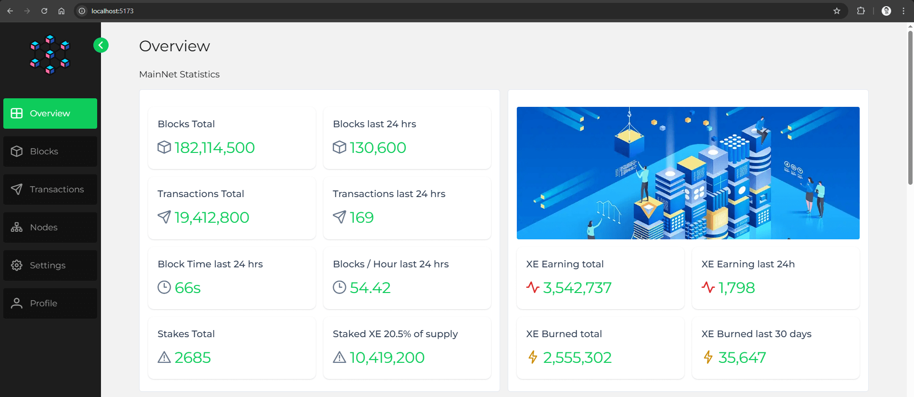
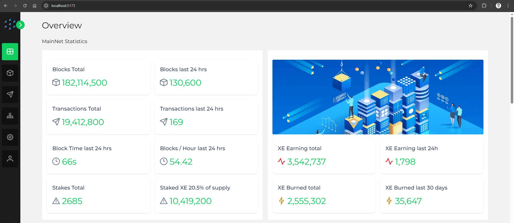
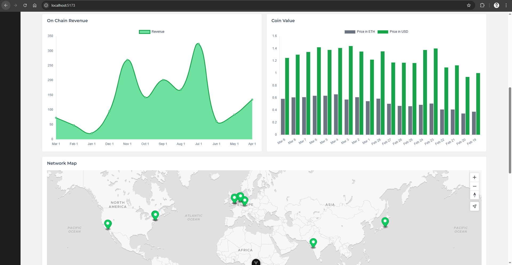
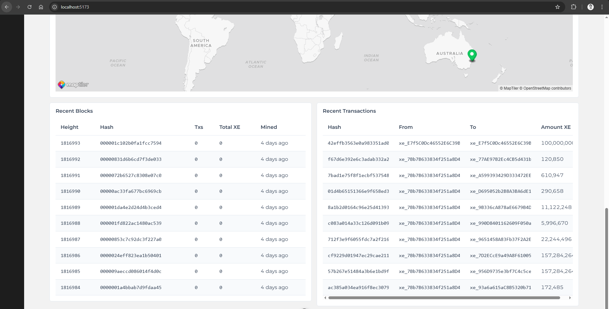

### Mobile Screenshots

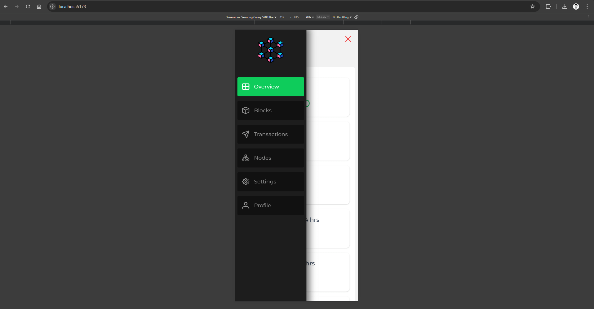
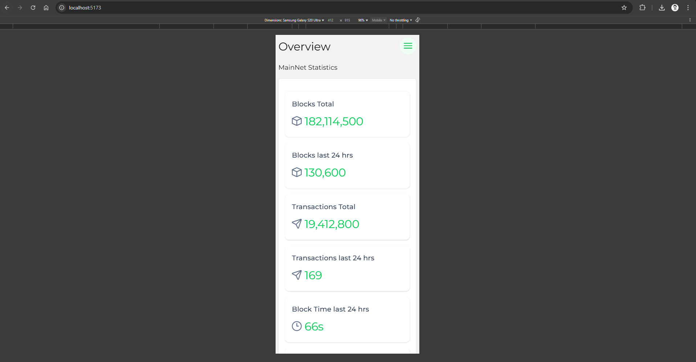
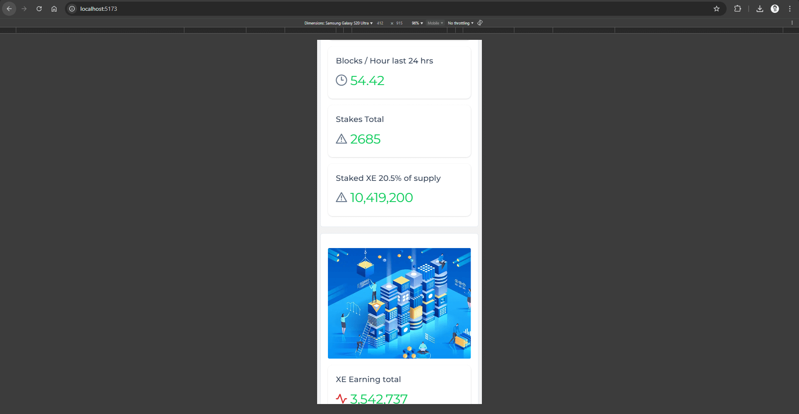
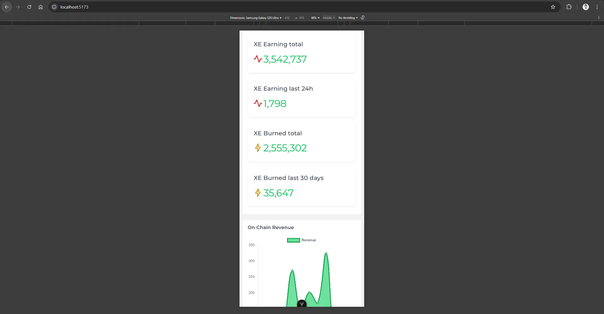
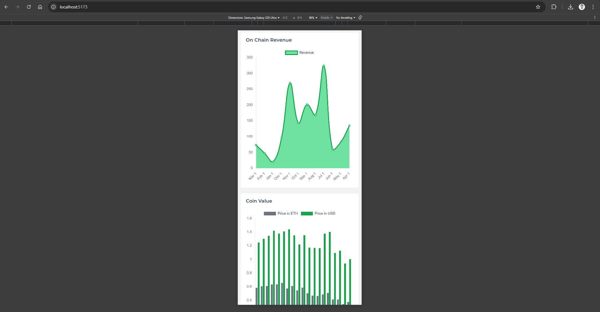
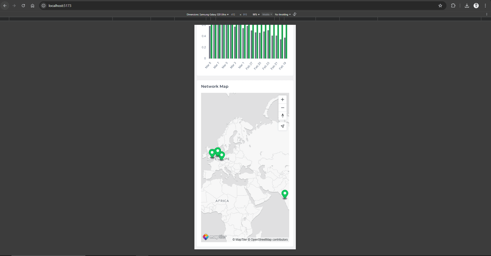
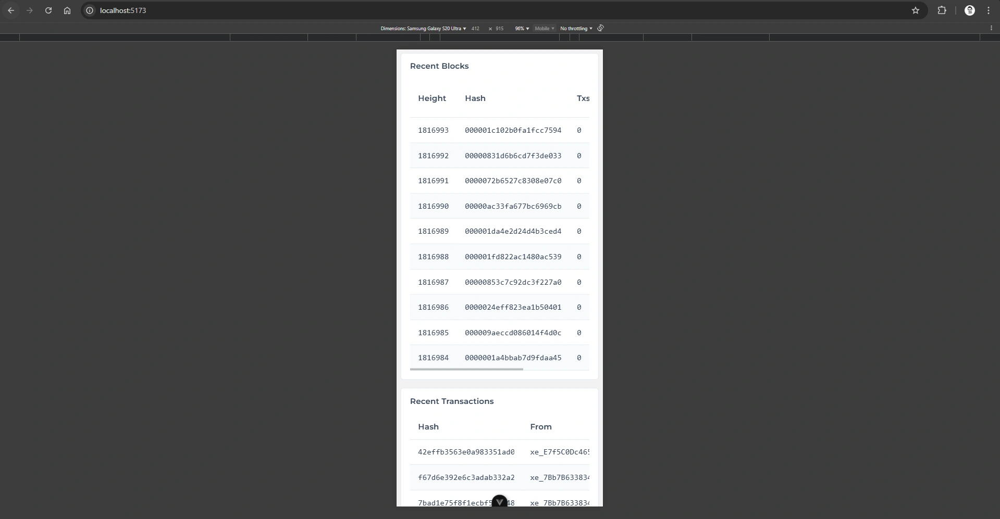
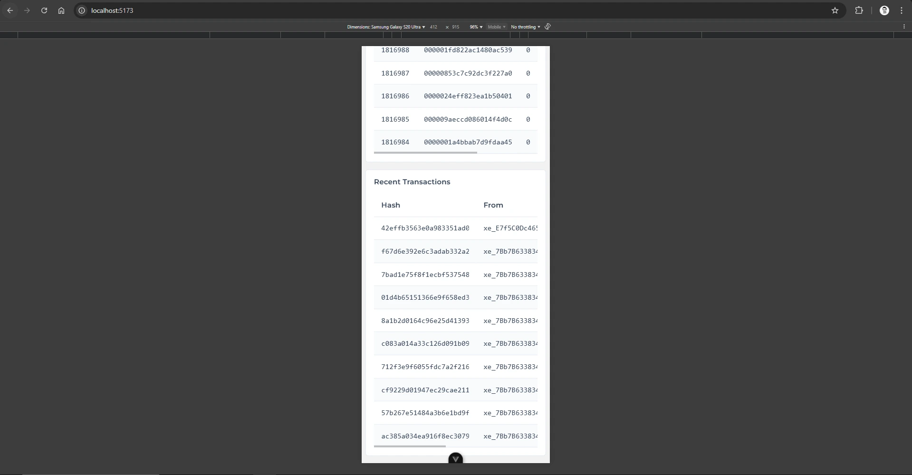
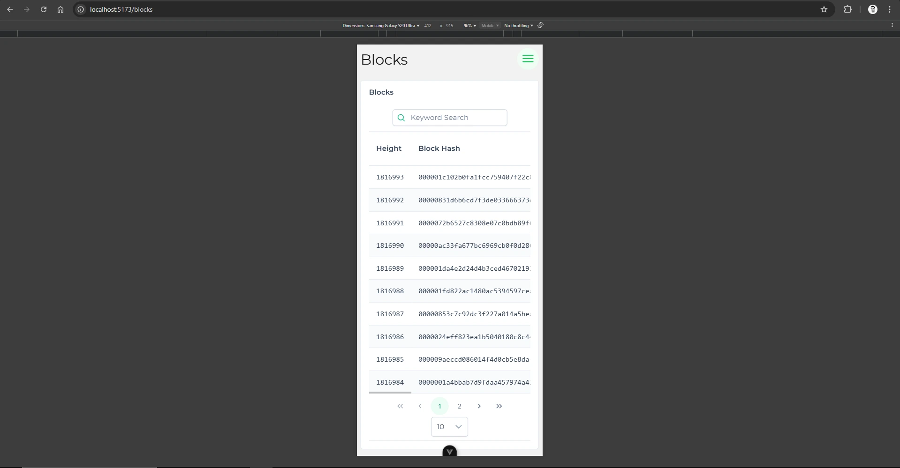
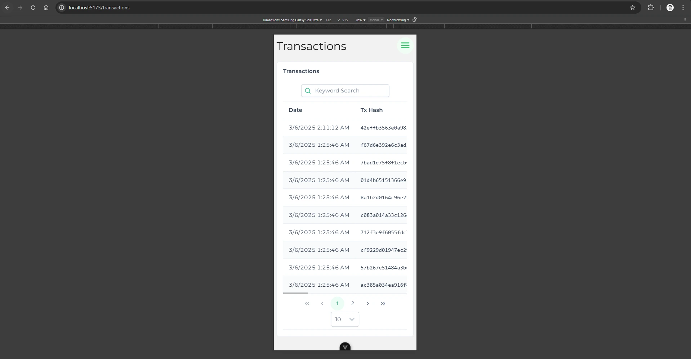
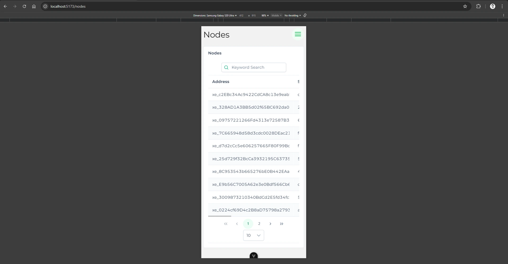
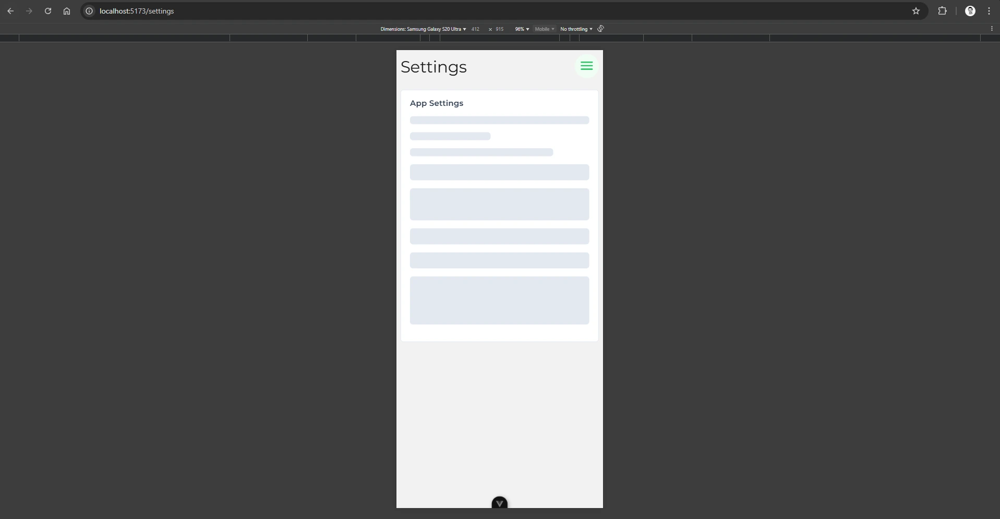
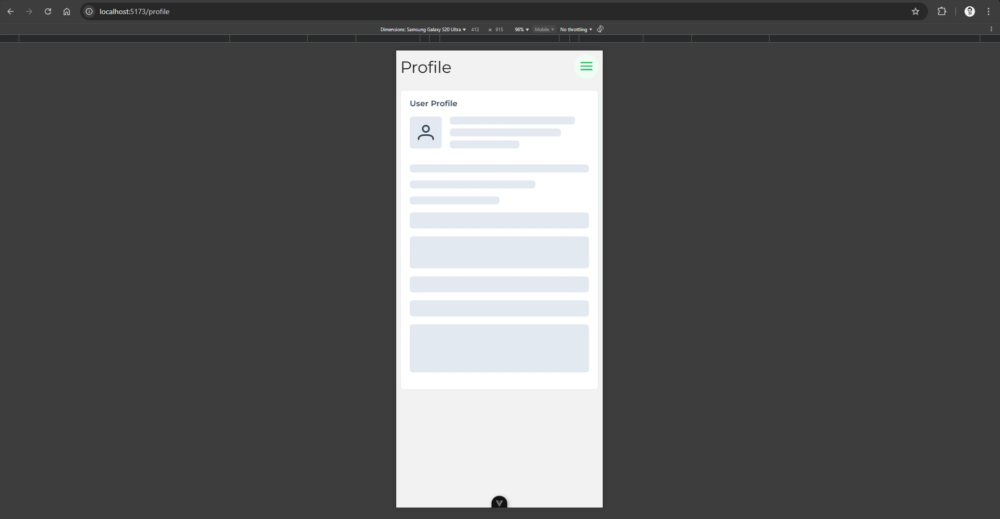
